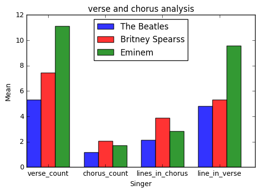

# Final Project - Part A - Analyze Data

## Scraping process

In this project we scrap the internet for songs lyrics. 
we do so using PyLyrics, its a python module providing easy API for getting songs lyrics 
from [https://lyrics.wikia.com](https://lyrics.wikia.com) website 

We scrap songs for **The Beatles**, **Britney Spears** and **Eminem** for each one we download all available lyrics using PyLyrics the code is in [lyrics_scraping.py](lyrics_scraping.py).

## Loading data


```python
import cPickle as Pickle

def load_song(path):
    with open(path, 'rb') as input_file:
        songs = Pickle.load(input_file)
    return songs

the_beatles_songs = load_song('The Beatles' + ".pkl")
britney_spears_songs = load_song('Britney Spears' + ".pkl")
eminem_songs = load_song('Eminem' + ".pkl")
```

We load the data from three pickle file each loading variable contain list of pairs
Each item in the list represent a song, when the firs item in the pair is the song headline and the second is the song lyrics.
lets see one song for example


```python
the_beatles_songs[0]
```


    ['I Saw Her Standing There',
     u"One, two, three, four!\n\nWell, she was just seventeen\nIf you know what I mean\nAnd the way she looked\nWas way beyond compare\nSo how could I dance with another\nWhen I saw her standing there?\n\nWell, she looked at me\nAnd I, I could see\nThat before too long\nI'd fall in love with her\nShe wouldn't dance with another\nWhen I saw her standing there\n\nWell, my heart went boom\nWhen I crossed that room\nAnd I held her hand in mine\n\nWhoa, we danced through the night\nAnd we held each other tight\nAnd before too long\nI fell in love with her\nNow, I'll never dance with another\nWhen I saw her standing there\n\nWell, my heart went boom\nWhen I crossed that room\nAnd I held her hand in mine\n\nOh, we danced through the night\nAnd we held each other tight\nAnd before too long\nI fell in love with her\nNow, I'll never dance with another\nSince I saw her standing there\nWhoa, since I saw her standing there\nYeah, well, since I saw her standing there"]


```python
num_of_songs=[len(the_beatles_songs),len(britney_spears_songs),len(eminem_songs)]
num_of_songs
```


    [347, 208, 231]


## Data preparation

### Organize the data


```python
#adding singer name to each song on the lsit
for song_list, singer in zip(
            [the_beatles_songs, britney_spears_songs, eminem_songs, ],
            ["The Beatles", "Britney Spearss", "Eminem"]):
        (map(lambda song: song.append(singer), song_list))
```

now each song is a triple headline,lyrics,singer


```python
the_beatles_songs[0:1]
```


    [['I Saw Her Standing There',
      u"One, two, three, four!\n\nWell, she was just seventeen\nIf you know what I mean\nAnd the way she looked\nWas way beyond compare\nSo how could I dance with another\nWhen I saw her standing there?\n\nWell, she looked at me\nAnd I, I could see\nThat before too long\nI'd fall in love with her\nShe wouldn't dance with another\nWhen I saw her standing there\n\nWell, my heart went boom\nWhen I crossed that room\nAnd I held her hand in mine\n\nWhoa, we danced through the night\nAnd we held each other tight\nAnd before too long\nI fell in love with her\nNow, I'll never dance with another\nWhen I saw her standing there\n\nWell, my heart went boom\nWhen I crossed that room\nAnd I held her hand in mine\n\nOh, we danced through the night\nAnd we held each other tight\nAnd before too long\nI fell in love with her\nNow, I'll never dance with another\nSince I saw her standing there\nWhoa, since I saw her standing there\nYeah, well, since I saw her standing there",
      'The Beatles']]


```python
# adding all songs to one list
songs_list=the_beatles_songs+britney_spears_songs+eminem_songs

#remove dupliaction
print ("songs befor remove dupliaction" + str(len(songs_list)) )

seen=set()
temp=[]
for song in songs_list:
    if not song[0] in seen:
        seen.add(song[0])
        temp.append(song)
songs_list=temp

print ("songs after remove dupliaction" + str(len(songs_list)) )
```

    songs befor remove dupliaction786
    songs after remove dupliaction580
    

we can see the 206 song where duplicate

### Cleaning the data


```python
import unicodedata
import re

#saving original songs structure for later analysis
songs_original_lyrics=[x[1] for x in songs_list]

#change song lyrics to string of words withot structure
regex = re.compile('[^a-zA-Z1-9\'\s]')
def clean_lyrics(song):
    song[1]=unicodedata.normalize('NFKD', song[1]).encode('ascii', 'ignore')
    song[1]=re.sub('[^a-zA-Z1-9\']'," ",song[1])
    song[1]=song[1].lower()

map(clean_lyrics ,songs_list)
songs_list[0:1]
```


    [['I Saw Her Standing There',
      "one  two  three  four   well  she was just seventeen if you know what i mean and the way she looked was way beyond compare so how could i dance with another when i saw her standing there   well  she looked at me and i  i could see that before too long i'd fall in love with her she wouldn't dance with another when i saw her standing there  well  my heart went boom when i crossed that room and i held her hand in mine  whoa  we danced through the night and we held each other tight and before too long i fell in love with her now  i'll never dance with another when i saw her standing there  well  my heart went boom when i crossed that room and i held her hand in mine  oh  we danced through the night and we held each other tight and before too long i fell in love with her now  i'll never dance with another since i saw her standing there whoa  since i saw her standing there yeah  well  since i saw her standing there",
      'The Beatles']]


### Feature engineering


```python
import nltk

# count number of words in each song
num_of_words=[len (nltk.word_tokenize(song[1])) for song in songs_list]
```


```python
import collections
#count the next features verse_number chorus_number lines_in_chorus avg_line_in_verse

songs_original_lyrics=map (lambda song : unicodedata.normalize('NFKD', song).encode('ascii', 'ignore'),songs_original_lyrics )
data=[]
for song in songs_original_lyrics:
    verse_list = song.split("\n\n")
    chorus = [item for item, count in collections.Counter(verse_list).items() if count > 1]
    verse = [item for item, count in collections.Counter(verse_list).items() if count == 1]
    verse_num=len(verse)
    chorus_num = [count for item, count in collections.Counter(verse_list).items() if count > 1][0] if len(chorus)>0 else 0   
    lines_in_chorus=len (chorus[0].split("\n")) if len(chorus)>0 else 0
    if len(verse)>0:
        avg_line_in_verse= float(reduce((lambda x, y: x + y),
                              map(lambda x: len(x.split("\n")),verse)))/len (verse)
    else:
        avg_line_in_verse=0
    data.append([verse_num,chorus_num,lines_in_chorus,avg_line_in_verse])

```


```python
#create data frame with all features per song
for song,word,features in zip(songs_list,num_of_words,data):
    song.append(word)
    song.extend (features)
    

import pandas as pd
df = pd.DataFrame(songs_list,columns=['headline','lyrics','singer','word_count','verse_count','chorus_count','lines_in_chorus_count','avg_line_in_verse_count'])    
#show examle of th data
df.head(3)

```


<div>
<table border="1" class="dataframe">
  <thead>
    <tr style="text-align: right;">
      <th></th>
      <th>headline</th>
      <th>lyrics</th>
      <th>singer</th>
      <th>word_count</th>
      <th>verse_count</th>
      <th>chorus_count</th>
      <th>lines_in_chorus_count</th>
      <th>avg_line_in_verse_count</th>
    </tr>
  </thead>
  <tbody>
    <tr>
      <th>0</th>
      <td>I Saw Her Standing There</td>
      <td>one  two  three  four   well  she was just sev...</td>
      <td>The Beatles</td>
      <td>189</td>
      <td>5</td>
      <td>2</td>
      <td>3</td>
      <td>5.400000</td>
    </tr>
    <tr>
      <th>1</th>
      <td>Misery</td>
      <td>the world is treating me bad misery  i'm the k...</td>
      <td>The Beatles</td>
      <td>129</td>
      <td>7</td>
      <td>0</td>
      <td>0</td>
      <td>3.857143</td>
    </tr>
    <tr>
      <th>2</th>
      <td>Anna (Go To Him)</td>
      <td>anna you come and ask me  girl to set you free...</td>
      <td>The Beatles</td>
      <td>205</td>
      <td>6</td>
      <td>0</td>
      <td>0</td>
      <td>6.666667</td>
    </tr>
  </tbody>
</table>
</div>


### Data understanding 

let's see summary of the data


```python
df.dropna().describe()
```


<div>
<table border="1" class="dataframe">
  <thead>
    <tr style="text-align: right;">
      <th></th>
      <th>word_count</th>
      <th>verse_count</th>
      <th>chorus_count</th>
      <th>lines_in_chorus_count</th>
      <th>avg_line_in_verse_count</th>
    </tr>
  </thead>
  <tbody>
    <tr>
      <th>count</th>
      <td>580.000000</td>
      <td>580.000000</td>
      <td>580.000000</td>
      <td>580.000000</td>
      <td>580.000000</td>
    </tr>
    <tr>
      <th>mean</th>
      <td>443.372414</td>
      <td>8.246552</td>
      <td>1.584483</td>
      <td>2.818966</td>
      <td>6.518048</td>
    </tr>
    <tr>
      <th>std</th>
      <td>319.514240</td>
      <td>6.990957</td>
      <td>1.552123</td>
      <td>2.955628</td>
      <td>5.520195</td>
    </tr>
    <tr>
      <th>min</th>
      <td>19.000000</td>
      <td>0.000000</td>
      <td>0.000000</td>
      <td>0.000000</td>
      <td>0.000000</td>
    </tr>
    <tr>
      <th>25%</th>
      <td>197.000000</td>
      <td>4.000000</td>
      <td>0.000000</td>
      <td>0.000000</td>
      <td>3.887255</td>
    </tr>
    <tr>
      <th>50%</th>
      <td>316.500000</td>
      <td>6.000000</td>
      <td>2.000000</td>
      <td>3.000000</td>
      <td>4.750000</td>
    </tr>
    <tr>
      <th>75%</th>
      <td>712.000000</td>
      <td>10.000000</td>
      <td>2.000000</td>
      <td>4.000000</td>
      <td>6.800000</td>
    </tr>
    <tr>
      <th>max</th>
      <td>1542.000000</td>
      <td>85.000000</td>
      <td>8.000000</td>
      <td>18.000000</td>
      <td>61.000000</td>
    </tr>
  </tbody>
</table>
</div>


We feel that the max value for each attribute is a little higher the expected so we will check the data just to be sure


```python
df.sort_values('word_count',ascending=False).head(3)
```


<div>
<table border="1" class="dataframe">
  <thead>
    <tr style="text-align: right;">
      <th></th>
      <th>headline</th>
      <th>lyrics</th>
      <th>singer</th>
      <th>word_count</th>
      <th>verse_count</th>
      <th>chorus_count</th>
      <th>lines_in_chorus_count</th>
      <th>avg_line_in_verse_count</th>
    </tr>
  </thead>
  <tbody>
    <tr>
      <th>566</th>
      <td>Bad Guy</td>
      <td>it's like i'm in this dirt digging up old hurt...</td>
      <td>Eminem</td>
      <td>1542</td>
      <td>21</td>
      <td>2</td>
      <td>7</td>
      <td>6.619048</td>
    </tr>
    <tr>
      <th>428</th>
      <td>Stan</td>
      <td>my tea's gone cold i'm wondering why i got out...</td>
      <td>Eminem</td>
      <td>1446</td>
      <td>22</td>
      <td>5</td>
      <td>6</td>
      <td>4.136364</td>
    </tr>
    <tr>
      <th>452</th>
      <td>We Shine</td>
      <td>bust it rugged  shine like a gold nugget   wha...</td>
      <td>Eminem</td>
      <td>1252</td>
      <td>5</td>
      <td>2</td>
      <td>8</td>
      <td>18.400000</td>
    </tr>
  </tbody>
</table>
</div>


```python
df.sort_values('verse_count',ascending=False).head(3)
```


<div>
<table border="1" class="dataframe">
  <thead>
    <tr style="text-align: right;">
      <th></th>
      <th>headline</th>
      <th>lyrics</th>
      <th>singer</th>
      <th>word_count</th>
      <th>verse_count</th>
      <th>chorus_count</th>
      <th>lines_in_chorus_count</th>
      <th>avg_line_in_verse_count</th>
    </tr>
  </thead>
  <tbody>
    <tr>
      <th>193</th>
      <td>The Beatles Third Christmas Record</td>
      <td>all    singing  all my troubles seemed so far...</td>
      <td>The Beatles</td>
      <td>1195</td>
      <td>85</td>
      <td>3</td>
      <td>1</td>
      <td>1.623529</td>
    </tr>
    <tr>
      <th>195</th>
      <td>Christmas Time (Is Here Again)</td>
      <td>j   it's a clumsy remix  take 444    all    s...</td>
      <td>The Beatles</td>
      <td>618</td>
      <td>52</td>
      <td>0</td>
      <td>0</td>
      <td>1.884615</td>
    </tr>
    <tr>
      <th>467</th>
      <td>The Kiss</td>
      <td>eminem  i'm gonna kill this bitch  i'm gonna ...</td>
      <td>Eminem</td>
      <td>332</td>
      <td>45</td>
      <td>0</td>
      <td>0</td>
      <td>2.177778</td>
    </tr>
  </tbody>
</table>
</div>


```python
df.sort_values('chorus_count',ascending=False).head(3)
```


<div>
<table border="1" class="dataframe">
  <thead>
    <tr style="text-align: right;">
      <th></th>
      <th>headline</th>
      <th>lyrics</th>
      <th>singer</th>
      <th>word_count</th>
      <th>verse_count</th>
      <th>chorus_count</th>
      <th>lines_in_chorus_count</th>
      <th>avg_line_in_verse_count</th>
    </tr>
  </thead>
  <tbody>
    <tr>
      <th>434</th>
      <td>I'm Back</td>
      <td>that's why they call me slim shady  i'm back  ...</td>
      <td>Eminem</td>
      <td>1059</td>
      <td>15</td>
      <td>8</td>
      <td>4</td>
      <td>4.933333</td>
    </tr>
    <tr>
      <th>577</th>
      <td>Beautiful Pain</td>
      <td>i can feel the heat rising everything is on fi...</td>
      <td>Eminem</td>
      <td>783</td>
      <td>7</td>
      <td>7</td>
      <td>4</td>
      <td>7.285714</td>
    </tr>
    <tr>
      <th>265</th>
      <td>I Love Rock 'N' Roll</td>
      <td>hey  is this thing on   i saw him dancing ther...</td>
      <td>Britney Spearss</td>
      <td>409</td>
      <td>5</td>
      <td>7</td>
      <td>4</td>
      <td>5.000000</td>
    </tr>
  </tbody>
</table>
</div>


```python
df.sort_values('lines_in_chorus_count',ascending=False).head(3)
```


<div>
<table border="1" class="dataframe">
  <thead>
    <tr style="text-align: right;">
      <th></th>
      <th>headline</th>
      <th>lyrics</th>
      <th>singer</th>
      <th>word_count</th>
      <th>verse_count</th>
      <th>chorus_count</th>
      <th>lines_in_chorus_count</th>
      <th>avg_line_in_verse_count</th>
    </tr>
  </thead>
  <tbody>
    <tr>
      <th>69</th>
      <td>You Won't See Me</td>
      <td>when i call you up your line's engaged i have ...</td>
      <td>The Beatles</td>
      <td>412</td>
      <td>3</td>
      <td>2</td>
      <td>18</td>
      <td>11.000000</td>
    </tr>
    <tr>
      <th>288</th>
      <td>Don't Hang Up</td>
      <td>baby i'm lying all alone a pillow is all i hav...</td>
      <td>Britney Spearss</td>
      <td>375</td>
      <td>5</td>
      <td>2</td>
      <td>16</td>
      <td>9.400000</td>
    </tr>
    <tr>
      <th>479</th>
      <td>Monkey See Monkey Do</td>
      <td>ha ha ha ha ha ha ha ay yo 5  whut i tell you ...</td>
      <td>Eminem</td>
      <td>713</td>
      <td>3</td>
      <td>2</td>
      <td>15</td>
      <td>23.666667</td>
    </tr>
  </tbody>
</table>
</div>


```python
df.sort_values('avg_line_in_verse_count',ascending=False).head(3)
```


<div>
<table border="1" class="dataframe">
  <thead>
    <tr style="text-align: right;">
      <th></th>
      <th>headline</th>
      <th>lyrics</th>
      <th>singer</th>
      <th>word_count</th>
      <th>verse_count</th>
      <th>chorus_count</th>
      <th>lines_in_chorus_count</th>
      <th>avg_line_in_verse_count</th>
    </tr>
  </thead>
  <tbody>
    <tr>
      <th>518</th>
      <td>Freestyle (Dissin' The Source)</td>
      <td>i got a riddle  what's little and talks big  w...</td>
      <td>Eminem</td>
      <td>517</td>
      <td>1</td>
      <td>0</td>
      <td>0</td>
      <td>61.0</td>
    </tr>
    <tr>
      <th>306</th>
      <td>Everytime (Valentin Remix)</td>
      <td>come notice me and take my hand so why are we ...</td>
      <td>Britney Spearss</td>
      <td>214</td>
      <td>1</td>
      <td>0</td>
      <td>0</td>
      <td>41.0</td>
    </tr>
    <tr>
      <th>525</th>
      <td>Dr. West (Skit)</td>
      <td>morning  marshall    morning  doc    so we're...</td>
      <td>Eminem</td>
      <td>324</td>
      <td>1</td>
      <td>0</td>
      <td>0</td>
      <td>40.0</td>
    </tr>
  </tbody>
</table>
</div>


Most of high valuse are for eminem wich make sense so most of them ok. but for the verse count max values we can see that The Beatles have a few records so we will remove those.


```python
df.loc[df['singer']=='The Beatles'].sort_values('verse_count',ascending=False).head(15)
```


<div>
<table border="1" class="dataframe">
  <thead>
    <tr style="text-align: right;">
      <th></th>
      <th>headline</th>
      <th>lyrics</th>
      <th>singer</th>
      <th>word_count</th>
      <th>verse_count</th>
      <th>chorus_count</th>
      <th>lines_in_chorus_count</th>
      <th>avg_line_in_verse_count</th>
    </tr>
  </thead>
  <tbody>
    <tr>
      <th>193</th>
      <td>The Beatles Third Christmas Record</td>
      <td>all    singing  all my troubles seemed so far...</td>
      <td>The Beatles</td>
      <td>1195</td>
      <td>85</td>
      <td>3</td>
      <td>1</td>
      <td>1.623529</td>
    </tr>
    <tr>
      <th>195</th>
      <td>Christmas Time (Is Here Again)</td>
      <td>j   it's a clumsy remix  take 444    all    s...</td>
      <td>The Beatles</td>
      <td>618</td>
      <td>52</td>
      <td>0</td>
      <td>0</td>
      <td>1.884615</td>
    </tr>
    <tr>
      <th>197</th>
      <td>The Beatles Seventh Christmas Record</td>
      <td>mama    j   now you lads  will you just shout ...</td>
      <td>The Beatles</td>
      <td>854</td>
      <td>43</td>
      <td>0</td>
      <td>0</td>
      <td>2.860465</td>
    </tr>
    <tr>
      <th>194</th>
      <td>Pantomime / Everywhere It's Christmas</td>
      <td>all    singing  ev'rywhere it's christmas ev'...</td>
      <td>The Beatles</td>
      <td>773</td>
      <td>35</td>
      <td>0</td>
      <td>0</td>
      <td>2.371429</td>
    </tr>
    <tr>
      <th>192</th>
      <td>Another Beatles Christmas Record</td>
      <td>all    singing  jingle bells      p   hello  ...</td>
      <td>The Beatles</td>
      <td>710</td>
      <td>29</td>
      <td>0</td>
      <td>0</td>
      <td>1.413793</td>
    </tr>
    <tr>
      <th>196</th>
      <td>The Beatles 1968 Christmas Record</td>
      <td>r   hello  this is a big  hi  and a sincere m...</td>
      <td>The Beatles</td>
      <td>900</td>
      <td>25</td>
      <td>0</td>
      <td>0</td>
      <td>4.480000</td>
    </tr>
    <tr>
      <th>191</th>
      <td>The Beatles Christmas Record</td>
      <td>hoo   all   good king wenceslas looked out on ...</td>
      <td>The Beatles</td>
      <td>954</td>
      <td>17</td>
      <td>0</td>
      <td>0</td>
      <td>2.823529</td>
    </tr>
    <tr>
      <th>187</th>
      <td>Hey Jude</td>
      <td>hey jude  don't make it bad take a sad song an...</td>
      <td>The Beatles</td>
      <td>405</td>
      <td>16</td>
      <td>3</td>
      <td>4</td>
      <td>3.500000</td>
    </tr>
    <tr>
      <th>149</th>
      <td>It's All Too Much</td>
      <td>spoken  to your mother   it's all too much  it...</td>
      <td>The Beatles</td>
      <td>411</td>
      <td>14</td>
      <td>2</td>
      <td>4</td>
      <td>4.642857</td>
    </tr>
    <tr>
      <th>177</th>
      <td>Let It Be</td>
      <td>when i find myself in times of trouble mother ...</td>
      <td>The Beatles</td>
      <td>272</td>
      <td>13</td>
      <td>0</td>
      <td>0</td>
      <td>4.000000</td>
    </tr>
    <tr>
      <th>104</th>
      <td>Good Morning Good Morning</td>
      <td>good morning good morning good morning good mo...</td>
      <td>The Beatles</td>
      <td>289</td>
      <td>12</td>
      <td>0</td>
      <td>0</td>
      <td>3.833333</td>
    </tr>
    <tr>
      <th>140</th>
      <td>Helter Skelter</td>
      <td>when i get to the bottom i go back to the top ...</td>
      <td>The Beatles</td>
      <td>366</td>
      <td>12</td>
      <td>2</td>
      <td>3</td>
      <td>4.583333</td>
    </tr>
    <tr>
      <th>216</th>
      <td>Get Back (Naked Version)</td>
      <td>spoken  rosetta level  john   sweet loretta fa...</td>
      <td>The Beatles</td>
      <td>233</td>
      <td>12</td>
      <td>0</td>
      <td>0</td>
      <td>4.333333</td>
    </tr>
    <tr>
      <th>183</th>
      <td>Get Back</td>
      <td>spoken  rosetta level  john   sweet loretta fa...</td>
      <td>The Beatles</td>
      <td>233</td>
      <td>12</td>
      <td>0</td>
      <td>0</td>
      <td>4.333333</td>
    </tr>
    <tr>
      <th>199</th>
      <td>She Loves You</td>
      <td>she loved you  yeah  yeah  yeah she loved you ...</td>
      <td>The Beatles</td>
      <td>237</td>
      <td>11</td>
      <td>0</td>
      <td>0</td>
      <td>3.909091</td>
    </tr>
  </tbody>
</table>
</div>


we can see that above 16 verse are records so we will remove does


```python
#remove all The Beatles recoreds
df1=df[df.singer=='The Beatles']
df1[df1.verse_count>16].index
df =df.drop(df1[df1.verse_count>16].index)
#show the new data summary
df.dropna().describe()
```


<div>
<table border="1" class="dataframe">
  <thead>
    <tr style="text-align: right;">
      <th></th>
      <th>word_count</th>
      <th>verse_count</th>
      <th>chorus_count</th>
      <th>lines_in_chorus_count</th>
      <th>avg_line_in_verse_count</th>
    </tr>
  </thead>
  <tbody>
    <tr>
      <th>count</th>
      <td>573.000000</td>
      <td>573.000000</td>
      <td>573.000000</td>
      <td>573.000000</td>
      <td>573.000000</td>
    </tr>
    <tr>
      <th>mean</th>
      <td>438.310646</td>
      <td>7.848168</td>
      <td>1.598604</td>
      <td>2.851658</td>
      <td>6.567209</td>
    </tr>
    <tr>
      <th>std</th>
      <td>317.557342</td>
      <td>5.561134</td>
      <td>1.551944</td>
      <td>2.958451</td>
      <td>5.534755</td>
    </tr>
    <tr>
      <th>min</th>
      <td>19.000000</td>
      <td>0.000000</td>
      <td>0.000000</td>
      <td>0.000000</td>
      <td>0.000000</td>
    </tr>
    <tr>
      <th>25%</th>
      <td>197.000000</td>
      <td>4.000000</td>
      <td>0.000000</td>
      <td>0.000000</td>
      <td>3.933333</td>
    </tr>
    <tr>
      <th>50%</th>
      <td>309.000000</td>
      <td>6.000000</td>
      <td>2.000000</td>
      <td>3.000000</td>
      <td>4.800000</td>
    </tr>
    <tr>
      <th>75%</th>
      <td>709.000000</td>
      <td>9.000000</td>
      <td>2.000000</td>
      <td>4.000000</td>
      <td>6.800000</td>
    </tr>
    <tr>
      <th>max</th>
      <td>1542.000000</td>
      <td>45.000000</td>
      <td>8.000000</td>
      <td>18.000000</td>
      <td>61.000000</td>
    </tr>
  </tbody>
</table>
</div>


comparing the different singers mean nomber of words


```python
df1=df[df.singer=='The Beatles']
df2=df[df.singer=='Britney Spearss']
df3=df[df.singer=='Eminem']
print ("The Beatles word count mean ="+ str(df1['word_count'].mean()))
print ("Britney Spearss word count mean ="+ str(df2['word_count'].mean()))
print ("Eminem word count mean ="+ str(df3['word_count'].mean()))
```

    The Beatles word count mean =197.464285714
    Britney Spearss word count mean =374.717948718
    Eminem word count mean =769.243523316
    

we can see thet eminem have a lot more words per song

lets compare the different singers on the other features


```python
#create data frame for each singer
the_beatles=[df1['verse_count'].mean(),df1['chorus_count'].mean(),df1['lines_in_chorus_count'].mean(),df1['avg_line_in_verse_count'].mean()]
britney_spearss=[df2['verse_count'].mean(),df2['chorus_count'].mean(),df2['lines_in_chorus_count'].mean(),df2['avg_line_in_verse_count'].mean()]
eminem=[df3['verse_count'].mean(),df3['chorus_count'].mean(),df3['lines_in_chorus_count'].mean(),df3['avg_line_in_verse_count'].mean()]

```


```python
%matplotlib inline
import numpy as np
import matplotlib.pyplot as plt
#plot the other feature comparison
n_groups = 4
fig, ax1  = plt.subplots()
index = np.arange(n_groups)
bar_width = 0.25

rects1 = plt.bar(index, the_beatles, bar_width,
                 alpha=0.8,
                 color='b',
                 label='The Beatles')
 
rects2 = plt.bar(index + bar_width, britney_spearss, bar_width,
                 alpha=0.8,
                 color='r',
                 label='Britney Spearss')

rects3 = plt.bar(index + bar_width*2, eminem, bar_width,
                 alpha=0.8,
                 color='g',
                 label='Eminem')
plt.xlabel('Singer')
plt.ylabel('Mean')
plt.title('verse and chorus analysis')
plt.xticks(index + bar_width*1.5, ('verse_count','chorus_count','lines_in_chorus','line_in_verse'))
plt.legend(loc='upper center')

```


    <matplotlib.legend.Legend at 0xc4e49b0>





We can see that the Eminem has a higher number of verse and another line per verse which makes sense given the word count and the fact that it is rapper.

lets check number of songs we have in our data per singer


```python
print ("The Beatles have "+ str(len(df1))+" songs")
print ("Britney Spearss have "+ str(len(df2))+" songs")
print ("Eminem have "+ str(len(df3))+" songs")
```

    The Beatles have 224 songs
    Britney Spearss have 156 songs
    Eminem have 193 songs
    


```python
# save the data
filename = 'songs.csv'
df.to_csv(filename, encoding='utf-8')
```
