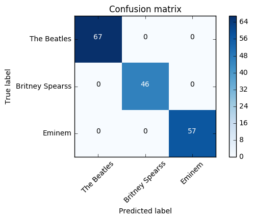

# Final Project - Part C and D - Text Generation


```python
%matplotlib inline
from sklearn.metrics import confusion_matrix
import matplotlib.pyplot as plt
import numpy as np
import theano
from keras.utils import np_utils
from keras.preprocessing.text import text_to_word_sequence
from keras.models import Sequential
from keras.layers import Dense
from keras.layers import Dropout
from keras.layers import LSTM
from sklearn.feature_extraction.text import CountVectorizer
import nltk
import itertools
from nltk.corpus import stopwords
import _pickle as cPickle
```

# Train Text Generetor

## Data Preprocessing

First, we will load the data from the previous part.


```python
import pandas as pd
df = pd.read_csv('songs2.csv')
```

Now, we are creating functions for the data preparation process, so we will be able to train our the neural networks.  
We will use those functions later on for each singer.

We will start by defining a function for getting the songs lyrics of a singer/band by the their names.


```python
# returns the artist lyrics
def load_lyrics(singer):
    dfs = df[df.singer == singer]
    lyrics = dfs['lyrics']
    return lyrics
```

Now, we would like to create a single string that contains all songs. We will also use some special tokens for **new stanza** and **new line**, which hopefully will help the text generator to learn also the songs structure.


```python
def data_cleaning(lyrics):
    # join all songs
    lyrics = " newstanza ".join(lyrics)
    # using special tokens
    lyrics = lyrics.replace('\r\n\r\n',' newstanza ')
    lyrics = lyrics.replace('\r\n',' newline ')
    return lyrics
```

Next, we will create the train data, by creating sequence of words from the lyrics of all songs as the input and the following word to that sequence as the output.  
We choose to use a vocabulary of the 500 most common words for each singer, so all other words will be replaced with the unknown token.


```python
def text_preprocessing(lyrics, seq_length):
    words = text_to_word_sequence(lyrics, lower=False, split=" ")
    # Initialize the "CountVectorizer"  
    vectorizer = CountVectorizer(analyzer="word", tokenizer=None, preprocessor=None, 
                                 stop_words=None, max_features=500) 
    # Create vocabulary from 500 words 
    vectorizer.fit_transform(words)
    vocab = vectorizer.get_feature_names()
    # Replace rare words with unknown token
    vocab.append("unknown")
    words=[w if w in vocab else "unknown" for w in words]
    # Create the train data set each row in dataX will conatain a list of words and the dataY the next word
    word_to_int = dict((c, i) for i, c in enumerate(vocab))
    n_words = len(words)
    n_vocab = len(vocab)
    dataX = []
    dataY = []
    for i in range(0, n_words - seq_length, 1):
        seq_in = words[i:i + seq_length]
        seq_out = words[i + seq_length]
        dataX.append([word_to_int[word] for word in seq_in])
        dataY.append(word_to_int[seq_out])
    return n_vocab, dataX, dataY
```

Next, we will define a function that will help us to normalize the data, so the model will be less affected by large numbers. 


```python
def normalize_data(dataX, dataY, n_vocab):
    # reshape X to be [samples, time steps, features]
    X = numpy.reshape(dataX, (len(dataX), len(dataX[0]), 1))
    # normalize
    X = X / float(n_vocab)
    # one hot encode the output variable
    Y = np_utils.to_categorical(dataY) 
    return X, Y
```

And lastly, putting it all together in a nice and simple function.


```python
def create_train_data(singer, seq_length):
    # loading the lyrics
    lyrics = load_lyrics(singer)
    # cleaning the data
    lyrics = data_cleaning(lyrics)
    # preprocess the data
    n_vocab, dataX, dataY = text_preprocessing(lyrics, seq_length)
    # normalize the data and return
    return normalize_data(dataX, dataY, n_vocab)
```

## Train The Models

In this part, we will create a new LSTM (Long Short Term Memory) model, which is a type of RNN (Recurrent Neural Network), that will be used to our song generation.  
The network is built with 1 *LSTM* layer as the recurrent layer of the model, then 1 *Dropout* layer for the prevention of overfitting and lastly 1 *Dense* layer that fits to the output size and uses softmax activation.


```python
def new_model(leng, dim, output_shape):
    model = Sequential()
    model.add(LSTM(1024, input_shape=(leng,dim)))
    model.add(Dropout(0.3))
    model.add(Dense(output_shape, activation='softmax'))
    model.compile(loss='categorical_crossentropy', optimizer='adam', metrics=["accuracy"])
    return model
```

We will train a new model for each singer, in which the LSTM layer is fed with a sequence of 25 words.


```python
X, Y = create_train_data("Eminem", 25)
model = new_model(X.shape[1], X.shape[2], Y.shape[1])
model.fit(X, Y, epochs=30, batch_size=128)
model.save_weights("EM-weights-25words-usingUnkown-lstm-model-withstruct-f.hdf5")
```

    Epoch 1/30
    154186/154186 [==============================] - 246s - loss: 3.9893 - acc: 0.3259   
    Epoch 2/30
    154186/154186 [==============================] - 246s - loss: 3.9653 - acc: 0.3265   
    Epoch 3/30
    154186/154186 [==============================] - 246s - loss: 3.9509 - acc: 0.3265   
    Epoch 4/30
    154186/154186 [==============================] - 246s - loss: 3.9366 - acc: 0.3266   
    Epoch 5/30
    154186/154186 [==============================] - 246s - loss: 3.9238 - acc: 0.3266   
    Epoch 6/30
    154186/154186 [==============================] - 246s - loss: 3.9095 - acc: 0.3267   
    Epoch 7/30
    154186/154186 [==============================] - 246s - loss: 3.8873 - acc: 0.3271   
    Epoch 8/30
    154186/154186 [==============================] - 246s - loss: 3.8603 - acc: 0.3283   
    Epoch 9/30
    154186/154186 [==============================] - 246s - loss: 3.8017 - acc: 0.3318   
    Epoch 10/30
    154186/154186 [==============================] - 246s - loss: 3.7239 - acc: 0.3386   
    Epoch 11/30
    154186/154186 [==============================] - 246s - loss: 3.6181 - acc: 0.3501   
    Epoch 12/30
    154186/154186 [==============================] - 246s - loss: 3.4905 - acc: 0.3664   
    Epoch 13/30
    154186/154186 [==============================] - 246s - loss: 3.3535 - acc: 0.3840   
    Epoch 14/30
    154186/154186 [==============================] - 246s - loss: 3.2104 - acc: 0.3994   
    Epoch 15/30
    154186/154186 [==============================] - 246s - loss: 3.0630 - acc: 0.4161   
    Epoch 16/30
    154186/154186 [==============================] - 246s - loss: 2.8999 - acc: 0.4332   
    Epoch 17/30
    154186/154186 [==============================] - 246s - loss: 2.7332 - acc: 0.4519   
    Epoch 18/30
    154186/154186 [==============================] - 246s - loss: 2.5533 - acc: 0.4729   
    Epoch 19/30
    154186/154186 [==============================] - 246s - loss: 2.3669 - acc: 0.4967   
    Epoch 20/30
    154186/154186 [==============================] - 246s - loss: 2.1809 - acc: 0.5232   
    Epoch 21/30
    154186/154186 [==============================] - 246s - loss: 1.9957 - acc: 0.5512   
    Epoch 22/30
    154186/154186 [==============================] - 246s - loss: 1.8137 - acc: 0.5807   
    Epoch 23/30
    154186/154186 [==============================] - 246s - loss: 1.6408 - acc: 0.6127   
    Epoch 24/30
    154186/154186 [==============================] - 246s - loss: 1.4743 - acc: 0.6427   
    Epoch 25/30
    154186/154186 [==============================] - 246s - loss: 1.3319 - acc: 0.6710   
    Epoch 26/30
    154186/154186 [==============================] - 246s - loss: 1.1967 - acc: 0.6995   
    Epoch 27/30
    154186/154186 [==============================] - 246s - loss: 1.0687 - acc: 0.7253   
    Epoch 28/30
    154186/154186 [==============================] - 246s - loss: 0.9641 - acc: 0.7483   
    Epoch 29/30
    154186/154186 [==============================] - 246s - loss: 0.8691 - acc: 0.7702   
    Epoch 30/30
    154186/154186 [==============================] - 246s - loss: 0.7906 - acc: 0.7894   


```python
X, Y = create_train_data("The Beatles", 25)
model = new_model(X.shape[1], X.shape[2], Y.shape[1])
model.fit(X, Y, epochs=30, batch_size=128)
model.save_weights("TB-weights-25words-usingUnkown-lstm-model-withstruct-f.hdf5")
```

    Epoch 1/30
    48895/48895 [==============================] - 77s - loss: 4.5096 - acc: 0.2011    
    Epoch 2/30
    48895/48895 [==============================] - 77s - loss: 4.4498 - acc: 0.2047    
    Epoch 3/30
    48895/48895 [==============================] - 77s - loss: 4.4439 - acc: 0.2047    
    Epoch 4/30
    48895/48895 [==============================] - 77s - loss: 4.4378 - acc: 0.2047    
    Epoch 5/30
    48895/48895 [==============================] - 78s - loss: 4.4265 - acc: 0.2046    
    Epoch 6/30
    48895/48895 [==============================] - 77s - loss: 4.3834 - acc: 0.2054    
    Epoch 7/30
    48895/48895 [==============================] - 78s - loss: 4.3409 - acc: 0.2054    
    Epoch 8/30
    48895/48895 [==============================] - 78s - loss: 4.2857 - acc: 0.2065    
    Epoch 9/30
    48895/48895 [==============================] - 78s - loss: 4.1786 - acc: 0.2127    
    Epoch 10/30
    48895/48895 [==============================] - 78s - loss: 4.0333 - acc: 0.2246    
    Epoch 11/30
    48895/48895 [==============================] - 78s - loss: 3.8419 - acc: 0.2438    
    Epoch 12/30
    48895/48895 [==============================] - 78s - loss: 3.5974 - acc: 0.2727    
    Epoch 13/30
    48895/48895 [==============================] - 78s - loss: 3.3035 - acc: 0.3098    
    Epoch 14/30
    48895/48895 [==============================] - 78s - loss: 2.9601 - acc: 0.3584    
    Epoch 15/30
    48895/48895 [==============================] - 78s - loss: 2.5785 - acc: 0.4200    
    Epoch 16/30
    48895/48895 [==============================] - 78s - loss: 2.1965 - acc: 0.4870    
    Epoch 17/30
    48895/48895 [==============================] - 78s - loss: 1.8225 - acc: 0.5608    
    Epoch 18/30
    48895/48895 [==============================] - 78s - loss: 1.4818 - acc: 0.6337    
    Epoch 19/30
    48895/48895 [==============================] - 78s - loss: 1.1938 - acc: 0.6971    
    Epoch 20/30
    48895/48895 [==============================] - 78s - loss: 0.9472 - acc: 0.7561    
    Epoch 21/30
    48895/48895 [==============================] - 78s - loss: 0.7412 - acc: 0.8086    
    Epoch 22/30
    48895/48895 [==============================] - 78s - loss: 0.5912 - acc: 0.8458    
    Epoch 23/30
    48895/48895 [==============================] - 78s - loss: 0.4682 - acc: 0.8800    
    Epoch 24/30
    48895/48895 [==============================] - 78s - loss: 0.3940 - acc: 0.8998    
    Epoch 25/30
    48895/48895 [==============================] - 78s - loss: 0.3356 - acc: 0.9174    
    Epoch 26/30
    48895/48895 [==============================] - 78s - loss: 0.2864 - acc: 0.9291    
    Epoch 27/30
    48895/48895 [==============================] - 78s - loss: 0.2719 - acc: 0.9321    
    Epoch 28/30
    48895/48895 [==============================] - 78s - loss: 0.2530 - acc: 0.9363    
    Epoch 29/30
    48895/48895 [==============================] - 78s - loss: 0.2315 - acc: 0.9417    
    Epoch 30/30
    48895/48895 [==============================] - 78s - loss: 0.2293 - acc: 0.9404    


```python
X, Y = create_train_data("Britney Spearss", 25)
model = new_model(X.shape[1], X.shape[2], Y.shape[1])
model.fit(X, Y, epochs=30, batch_size=128)
model.save_weights("BS-weights-25words-usingUnkown-lstm-model-withstruct-f.hdf5")
```

    Epoch 1/30
    62773/62773 [==============================] - 100s - loss: 4.4195 - acc: 0.2069   
    Epoch 2/30
    62773/62773 [==============================] - 100s - loss: 4.3786 - acc: 0.2086   
    Epoch 3/30
    62773/62773 [==============================] - 100s - loss: 4.3706 - acc: 0.2086   
    Epoch 4/30
    62773/62773 [==============================] - 100s - loss: 4.3524 - acc: 0.2084   
    Epoch 5/30
    62773/62773 [==============================] - 100s - loss: 4.3036 - acc: 0.2089   
    Epoch 6/30
    62773/62773 [==============================] - 100s - loss: 4.2408 - acc: 0.2106   
    Epoch 7/30
    62773/62773 [==============================] - 100s - loss: 4.1602 - acc: 0.2137   
    Epoch 8/30
    62773/62773 [==============================] - 100s - loss: 4.0392 - acc: 0.2210   
    Epoch 9/30
    62773/62773 [==============================] - 100s - loss: 3.8228 - acc: 0.2393   
    Epoch 10/30
    62773/62773 [==============================] - 100s - loss: 3.5008 - acc: 0.2805   
    Epoch 11/30
    62773/62773 [==============================] - 100s - loss: 3.0895 - acc: 0.3438   
    Epoch 12/30
    62773/62773 [==============================] - 100s - loss: 2.6597 - acc: 0.4195   
    Epoch 13/30
    62773/62773 [==============================] - 100s - loss: 2.2461 - acc: 0.4945   
    Epoch 14/30
    62773/62773 [==============================] - 100s - loss: 1.8880 - acc: 0.5619   
    Epoch 15/30
    62773/62773 [==============================] - 100s - loss: 1.5463 - acc: 0.6294   
    Epoch 16/30
    62773/62773 [==============================] - 100s - loss: 1.2715 - acc: 0.6865   
    Epoch 17/30
    62773/62773 [==============================] - 100s - loss: 1.0233 - acc: 0.7402   
    Epoch 18/30
    62773/62773 [==============================] - 100s - loss: 0.8215 - acc: 0.7899   
    Epoch 19/30
    62773/62773 [==============================] - 100s - loss: 0.6617 - acc: 0.8285   
    Epoch 20/30
    62773/62773 [==============================] - 100s - loss: 0.5378 - acc: 0.8618   
    Epoch 21/30
    62773/62773 [==============================] - 100s - loss: 0.4483 - acc: 0.8848   
    Epoch 22/30
    62773/62773 [==============================] - 100s - loss: 0.3788 - acc: 0.9025   
    Epoch 23/30
    62773/62773 [==============================] - 100s - loss: 0.3353 - acc: 0.9163   
    Epoch 24/30
    62773/62773 [==============================] - 100s - loss: 0.3077 - acc: 0.9210   
    Epoch 25/30
    62773/62773 [==============================] - 100s - loss: 0.2836 - acc: 0.9275   
    Epoch 26/30
    62773/62773 [==============================] - 100s - loss: 0.2721 - acc: 0.9288   
    Epoch 27/30
    62773/62773 [==============================] - 100s - loss: 0.2471 - acc: 0.9359   
    Epoch 28/30
    62773/62773 [==============================] - 100s - loss: 0.2380 - acc: 0.9380   
    Epoch 29/30
    62773/62773 [==============================] - 100s - loss: 0.2464 - acc: 0.9349   
    Epoch 30/30
    62773/62773 [==============================] - 100s - loss: 0.2255 - acc: 0.9395   


# Song Generation

In this part, we will generate 30% more songs for each artist, based on the original number of songs we scraped in the first part. Each song will have a length that can be somewhere between the median length of the artist's song (50th percentile) and the 75th percentile length of the artist's song.

The next function extracts this information and the songs lyrics for each singer.


```python
def songs_by_singer(singer, df):
    df2 = df[df.singer == singer]
    lyrics = df2['lyrics']
    min_len = int(df2.word_count.quantile(0.5))
    max_len = int(df2.word_count.quantile(0.75))
    num_of_songs_to_generate = int(len(lyrics) * 0.3)
    return lyrics, min_len, max_len, num_of_songs_to_generate
```

The next function is used in order to get the data of each singer, the mapping of each word in the bag of words and length of the vocabulary.  
This will be used for generating the new songs with random seeds from the orginal songs and converting them back to words from integers, as the training state requires.


```python
def create_train_data_set(lyrics,seq_length):
    # join songs by song end token
    lyrics = " newstanza ".join(lyrics)
    # replace new line and new stanza with tokens
    lyrics = lyrics.replace('\r\n\r\n',' newstanza ')
    lyrics = lyrics.replace('\r\n',' newline ')
    # create vocabulary
    words = text_to_word_sequence(lyrics, lower=False, split=" ")
    vectorizer = CountVectorizer(analyzer="word", tokenizer=None, preprocessor=None,
                                 stop_words=None, max_features=500) 
    vectorizer.fit_transform(words)
    vocab = vectorizer.get_feature_names()
    # replace unknown words
    vocab.append("unknown")
    words=[w if w in vocab else "unknown"  for w in words]
    word_to_int = dict((c, i) for i, c in enumerate(vocab))
    int_to_word = dict((i, c) for i, c in enumerate(vocab))
    n_words = len(words)
    n_vocab = len(vocab)
    # create train set words sequence as input set the next word as output 
    dataX = []
    dataY = []
    for i in range(0, n_words - seq_length, 1):
        seq_in = words[i:i + seq_length]
        dataX.append([word_to_int[word] for word in seq_in])
    return dataX, int_to_word, n_vocab
```

The next function generates the songs word by word. It starts by using random sequence of words from the authentic songs of the artist and sends them the our model so it will predict the next word. The next word is chosen randomly from the 3 most likely words that predicted by the model as the next word (while avoiding the unknown token from appearing in the generated songs).  
The random sequences that the songs are generated from are not a part of the generated songs.


```python
def generate_songs_helper(num_songs, model_path, song_len_min, song_len_max, dataX, int_to_word, n_vocab,seq_length):
    # loading the model
    model.load_weights(model_path, by_name=False)
    genrated_songs = []
    start = np.random.choice(len(dataX)-1, num_songs)
    for i in range(num_songs):
        # pick a random seed from the train data
        pattern = dataX[start[i]]
        text = ""
        # generate words
        song_length = numpy.random.randint(low=song_len_min, high=song_len_max)
        for i in range(song_length) :
            if len(pattern) > seq_length:
                pattern.pop(0)
            x = numpy.reshape(pattern, (1, len(pattern), 1))
            x = x / float(n_vocab)
            prediction = model.predict(x, verbose=0)
            # choose one word of the best 3 that the model predict
            best_3 = prediction.argsort() [0][-3:]
            # avoiding the unknown token
            index = np.argwhere(best_3 == 500)
            best_3 = np.delete(best_3, index)
            index = np.random.choice(best_3, 1)[0]
            #add the new word to the song
            result = int_to_word[index]
            text += " " + result
            # deleting the first word in sequance and adding the new one to the end
            seq_in = [int_to_word[value] for value in pattern]
            pattern.append(index)
            pattern = pattern[1:len(pattern)]
        genrated_songs.append(text) 
    return genrated_songs    
```

Again, we will put it all together in a nice function, initialized with a sequence length of 25 - the same as in our trained model.


```python
def generate_songs(singer, path):
    seq_length = 25
    lyrics, min_len, max_len, num_of_songs_to_generate = songs_by_singer(singer, df)
    dataX, int_to_word, n_vocab = create_train_data_set(lyrics, seq_length)
    songs_list = generate_songs_helper(num_of_songs_to_generate, path, min_len, max_len, dataX, int_to_word, n_vocab,seq_length)
    return songs_list, [singer] * num_of_songs_to_generate
```

### Generating the songs for each singer

We will load the weight we saved for of our trained models, and we will generate from them 30% new songs for each one of the 3 artists.


```python
songs_list, label_list = [], []
ansX, ansY = generate_songs("The Beatles", "TB-weights-25words-usingUnkown-lstm-model-withstruct-f.hdf5")
songs_list += ansX
label_list += ansY
print(str(len(ansX)), "new songs were generated for The Beatles")
```

    67 new songs were generated for The Beatles


```python
ansX, ansY = generate_songs("Britney Spearss", "BS-weights-25words-usingUnkown-lstm-model-withstruct-f.hdf5")
songs_list += ansX
label_list += ansY
print(str(len(ansX)), "new songs were generated for Britney Spears")
```

    46 new songs were generated for Britney Spears


```python
ansX, ansY = generate_songs("Eminem", "EM-weights-25words-usingUnkown-lstm-model-withstruct-f.hdf5")
songs_list += ansX
label_list += ansY
print(str(len(ansX)), "new songs were generated for Eminem")
```

    57 new songs were generated for Eminem


Lets see some examples of our generated songs:


```python
generated_songs = songs_list
song_examples = [generated_songs[0], generated_songs[67], generated_songs[113]]
for song in song_examples:
    song = song.replace('newline', ' \n')
    song = song.replace('newstanza', ' \n\n')
    print("SONG:\n" + song + "\n")
```

    SONG:
      
     yeah does does me oh yeah let let looking ooh heart his she she  
     our she honey the the his two me  
     yeah  
     hey yeah yeah  
     yeah cry you  
     to  
     here but waiting garden by ha  
     ha ha daa  
     my love place be skelter  
    
     in be  
      
    
      
     to up in you out or kiss your  
     of been of  
    
     well know it  
     for me makes of  
     her her you  
     me our his la to goes me love for  
     you want  
    
     guten morgen whoo life  
     do  
     whoo  
      
     blue  
     yeah make me do  
     yeah make know darling  
    
     as in yeah know  
     is how why be it blue yeah yeah yeah she me you down home  
     be but when this here me  
     but you need girl is  
    
     whoo  
     from you need is take all love  
    
     all  
      
    
     is  
    
     love all love  
     is  
     all on  
    
     is he me child  
      
    
     all there you to to me  
    
     no get the need my down  
     do you need is on fun all you is
    
    SONG:
     all  
    
     when we be when bass yes  
     bigger we you see  
     the  
     in like  
     baby is my loneliness the crowd me again me control you me take me down down britney  
     the the in in  
      
     is oh we little come you got down  
     my  
     my britney on my on is take we be the my  
    
     but take  
     go me  
      
     name my we your  
     be the still there will baby that that that out  
     will  
     in take me like the me another  
     the in to loneliness just we my to  
    
     that that  
     you that she that  
    
     now not you in  
     you you now me if  
    
     what and that feel what you  
     me oh gotta oh baby  
    
     the  
     you gonna  
     come to my my so so out and under  
     there  
     wanna huh  
     all the  
     in  
     baby me me you up girl hear kiss is you  
     me last all the you  
     boys your you not  
     uh  
      
     been you love you  
    
     you you always be me for all and  
     when the this to and what came to be the you gonna the got my you so so so but was  
      
     name was had feeling we we  
      
      
     we to for you all that  
     his is the really wanna we we  
    
      
      
     up can with with go mind my baby  
     this  
     you gonna all my you but is your in how all  
    
     the baby  
    
      
    
     is the beautiful about  
      
     from the my the the just the all she that breathe that  
     but but  
     control about to of is day all every night  
     you drive lose crazy you make me crazy eh  
    
     baby so as so want damn ooh so  
      
     can you me so  
      
     we up up we wanna and  
     when can we can is that in felt heart heart  
     bass my let and on on on hold yeah  
    
     there to you  
     up  
    
     yeah to party it it the me now  
    
     you out in you  
    
      
    
     can  
    
     my you know stronger me give on tonight  
     and the that all you uh that  
     all you
    
    SONG:
     what me you my my name head my no so  
     say  
     you you the way in the in everything the time  
     eminem you man like shady just to us  
     it you never you call your it in the way my  
     he one the your again  
    
     you  
     was to but your the that of and  
      
     so just mean to me out was just get you come now you up know better  
     think oh from eminem  
     to to  
     call gone crazy  
    
      
    
     dre can just shady the him  
     my city  
     come to come  
     this me they  
     but  
     and  
    
     in on royce me for  
     me me eminem  
    
     drugs da with is  
     and come  
     me da  
     da come with da rock  
     da  
     and come with da off  
     get that da off on of  
     all just like still come ass up the off dre and  
     the and you get boy this love we way  
    
     as and knows that you one  
    
     eminem  
     damn sing damn even just made just me this never up life life  
     no me about  
     you me  
     rock city  
    
     so on on me on your on  
     in  
    
     dr the in kill the street  
     our way  
    
     dr the way  
    
      
    
      
     god there your sing bitches the not to your  
     your to and to with me  
    
     the can with  
     left  
      
     got us  
      
    
     like but the and you about you this  
     with my like me you all do just you you of from the half we as  
    
     the reason you is of the up  
     but your about about out me to me got  
     it  
     the the little got you  
     get up but you my his my his and off you we my this him just take  
     and for the that  
     it you go this now and in the your  
    
     and now comes me just me the song got  
     my  
     this your got something in  
    
     better again got me bad  
     you  
    
     with the city the  
      
     eminem  
     there know is dre  
    
      
     me on royce for nigga  
      
     dre ass  
     hold  
    
     with shady  
      
     one  
     come come  
    
     come the city me  
     da  
    
      
     come with me  
    
      
     come and come on  
     come  
     one city da  
      
    
     eminem  
      
     block on  
      
     for da down  
     dr  
     da da with da off  
     da da  
     da da  
     da and down aah baby baby  
     just lose  
     aah aah down aah aah  
     go crazy down down down aah baby  
     baby go  
     aah down down down baby  
    
     oh crazy down aah down aah aah aah  
     go oh down aah and aah aah aah  
    
      
     aah aah  
     aah baby down  
     oh baby my aah down down  
     baby baby aah  
    
     baby  
     and get baby  
    
     get get it aah aah aah down down  
     down down  
     down down down aah aah  
     get baby aah down down aah baby  
     oh aah down  
     oh baby  
    
     aah my was  
     my it  
    
      
     the is  
    
     scream come on  
     come with me  
    
     and  
     no come dre  
      
    
     da  
     royce eminem dre  
     yo  
     with  
     come two come  
    
     but come on  
    
     and  
     me me with  
      
      
     is  
    
     on on and come  
      
     da da royce one da da  
     one that fuck get on  
    
     eminem that fuck shake for me that me  
      
     and slim time of the who with  
     and  
     with with you is is  
     yo me her  
     my my my our me no  
    
      
     as as as me as  
     with  
    
     with rock back rock  
      
    
     come on and rock with is slim  
     da  
     and  
      
     rock with and on and rock this me they  
     one  
     yeah me me on  
    
     yeah come crazy you the  
    
     no say  
    
      
     me me  
      
     oh  
     oh bitch  
     and  
    
     no  
    
     they shady want the up up fuck and motherfucker  
    
     they they what it eminem  
     my get her all to the  
      
     and off  
     the his ass  
     in the come on my in come  
     his as for me with that for for with and come  
     on eminem that shit  
     of kids and as as bad you that they was was and them at  
    
      
    
     you the all dad to be this nigga  
     we fuck seen leave the always all like on  
     of show you need  
     all you me  
    
    


We can see that our models had difficulty to learn the songs structure, but on some parts it actually did not a bad job.  
Also, we can see that there are differences in the words used for each artist.

# Classification of the Generated Songs

We will start by loading our classifier and vectorizer from part B.


```python
with open('classfier.pkl', 'rb') as f:
    rf = cPickle.load(f, encoding='latin1')
    
with open('vectorizer.pkl', 'rb') as f:
    vectorizer = cPickle.load(f, encoding='latin1') 
```

Now we will process the generated data to be ready for classification.


```python
# removing tokens
clean_song_list = []
for song in genrated_songs:
    song = song.replace(' newline ',' ')
    song = song.replace(' newstanza ',' ')
    clean_song_list.append(song)
genrated_songs = clean_song_list

# download english stop words list
stop_words = stopwords.words("english")

def important_words(song_lyrics):
    # remove stop words
    words = nltk.word_tokenize(song_lyrics)
    words = [w for w in words if not w in stop_words]
    # Stemming
    porter = nltk.PorterStemmer()
    words = [porter.stem(w) for w in words]
    return " ".join(words)

# creating data features from generated songs
generated_songs = [important_words(l) for l in generated_songs]
data_features = vectorizer.fit_transform(generated_songs)
data_features = data_features.toarray()
```


```python
print("Accuracy: %0.2f" % rf.score(data_features, label_list))
```

    Accuracy: 1.00


We can see that our classifier had an accuracy of **100%** while identifing our machine generated songs for the singers. This result is quite impressive!


```python
def plot_confusion_matrix(cm, classes):
    plt.imshow(cm, interpolation='nearest', cmap=plt.cm.Blues) 
    plt.colorbar()
    tick_marks = np.arange(len(classes))
    plt.xticks(tick_marks, classes, rotation=45)
    plt.yticks(tick_marks, classes)

    thresh = cm.max() / 2.
    for i, j in itertools.product(range(cm.shape[0]), range(cm.shape[1])):
        plt.text(j, i, cm[i, j], horizontalalignment="center", color="white" if cm[i, j] > thresh else "black")

    plt.tight_layout()
    plt.title('Confusion matrix')
    plt.ylabel('True label')
    plt.xlabel('Predicted label')

y_pred = rf.predict(data_features)
labels = ["The Beatles", "Britney Spearss", "Eminem"]
conf_mat = confusion_matrix(label_list, y_pred, labels=labels)
plot_confusion_matrix(conf_mat, labels)
```





We can see that all songs were classified correctly, which means that our RandomForest model from the last part indeed had high level of accuracy, and our RNN models successfully learned the artists songs and generated songs the look exactly like their original songs, from the machine's point of view - which is what we tried to achieve.
